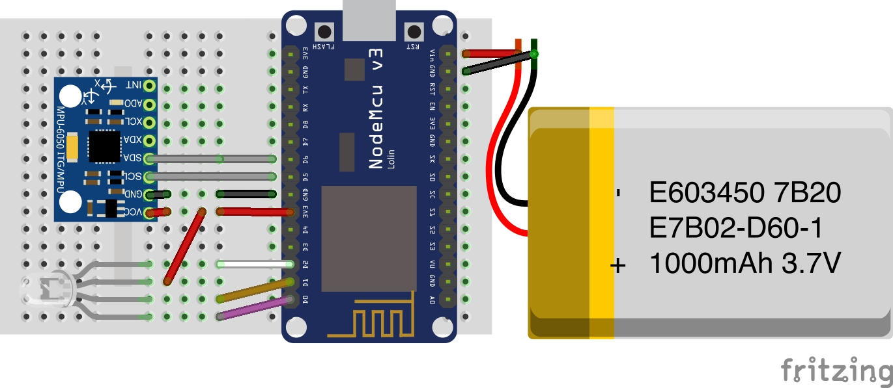
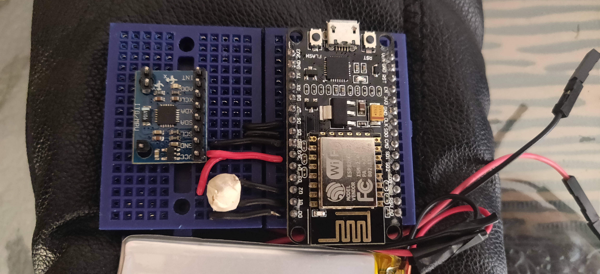
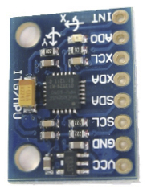
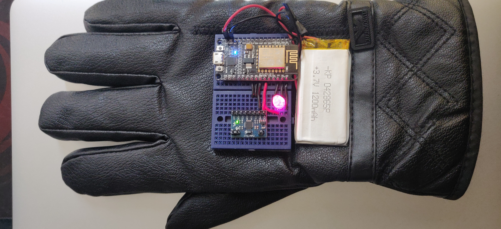

# Gesture Controlled RaspberryPi Rover

This repo contains a set of python scripts to drive a Raspberry Pi rover (Adeept Mars Rover PiCar-B) with Hand Gestures. The application code is not tighly coupled to work only with Adeept Mars Rover and can be easily updated to drive any Raspberry Pi enabled rover.

Here is a full video of the rover in action:

<a href="http://www.youtube.com/watch?feature=player_embedded&v=g4PktYVmZK4&t=11s" target="_blank"></a>

I am using [NodeMCU](https://www.nodemcu.com/index_en.html) wired to a GY-521 MPU6050 3-Axis Acceleration Gyroscope chip to read the acceleration values generated upon hand movement. These values are then further transmitted to the Raspberry Pi rover over an MQTT channel.

The Raspberry Pi runs an MQTT server and upon receving the values from the connected NodeMCU client, calculates the turn direction (left, right, forward and backward) for the rover and accordingly moves it.

## Prerequisites
- Raspberry Pi
- [NodeMCU](https://www.nodemcu.com/index_en.html)
- GY-521 MPU6050
- Mini Breadboard
- Multi-Color LED
- Lithium polymer battery to power NodeMCU
- Connecting wires
- Assembled [Adeept Mars Rover PiCar-B](https://www.adeept.com/adeept-mars-rover-picar-b-wifi-smart-robot-car-kit-for-raspberry-pi-3-model-b-b-2b-speech-recognition-opencv-target-tracking-stem-kit_p0117_s0030.html)
<br/>
- Arduino IDE
- A pair of hand gloves (one is enough depending on your preference)

## Setup
#### Hardware
*  Use the image below as a reference and wire the NodeMCU, GY-521 MPU6050, Multi-Color LED and NodeMCU on top of an Breadboard



* Ensure you keep the direction of the GY-521 MPU6050 chip exactly as shown in the image. 
The INT pin should be facing towards the fingers of the glove


* Mount the NodeMCU over the top of the glove. I used a double sided tape to glue the breadboard to the glove


#### Software
* Setting up an MQTT communication: I found this very helpfull post on setting up and using MQTT communication between a [Raspberry Pi and NodeMCU](https://www.instructables.com/id/How-to-Use-MQTT-With-the-Raspberry-Pi-and-ESP8266/). Follow till section `Step 3: Testing the Broker` of the post. Keep a note of the MQTT credentials
* Install Python Client (paho-mqtt) on Raspberry Pi
`sudo pip3 install paho-mqtt`
* Download this Repository on the Raspberry Pi
  `git clone https://github.com/erviveksoni/gesture-controlled-raspberrypi-rover`
* cd to the `gesture-controlled-raspberrypi-rover` folder
* Open the `drive.py` file and update following section with the details of the MQTT configurations 
```python
mqtt_username = ""
mqtt_password = ""
mqtt_topic = ""
```
* Refer this post on configruing [Arduino IDE with NodeMCU](https://www.instructables.com/id/Quick-Start-to-Nodemcu-ESP8266-on-Arduino-IDE/)
* Download the [nodemcu sketch file](https://github.com/erviveksoni/gesture-controlled-raspberrypi-rover/blob/master/nodemcu_sketch/nodemcu_sketch.ino) to your local machine
* Open this file in Arduino IDE and update the following section of the sketch with the correct details:
```c
const char* ssid = "";
const char* wifi_password = "";
const char* mqtt_server = ""; #IP Address of the raspberry pi
const char* mqtt_topic = "";
const char* mqtt_username = "";
const char* mqtt_password = "";
```
* Upload the sketch to NodeMCU

## Usage
* SSH to your raspberry pi  
* `cd gesture-controlled-raspberrypi-rover`
* Run `python3 drive.py`
* Power on the NodeMCU and wait for it to connect to the Raspberry Pi rover. The LED status on the glove should change to green once the NodeMCU starts transmitting data to Raspberry Pi
